**APACHE SERVER USING USER SCRIPTS**

**Create a new instance with public subnet.**

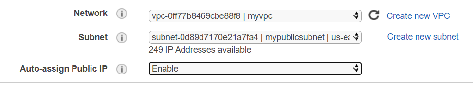

We use the security group created earlier; it can be configured later if
required.

Confirm the key and launch instance.

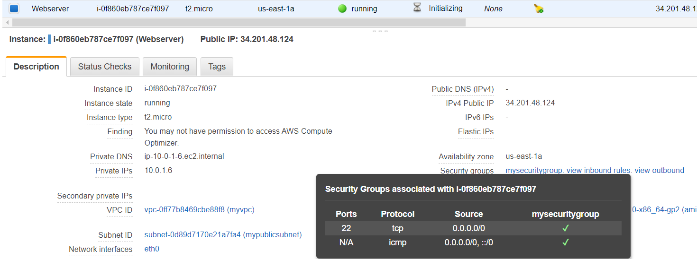

**Connect to this instance using “PuTTY”**
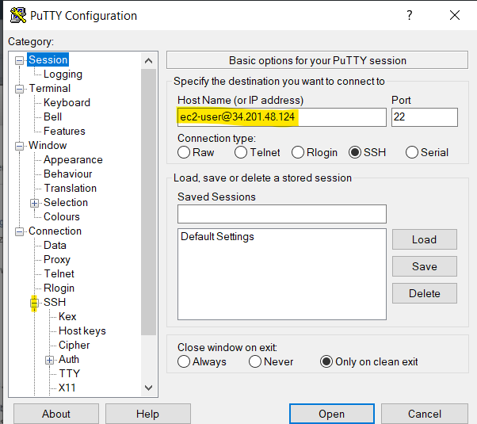

Put the username and ip address in hostname.

We need to provide PuTTY with the key to access this instance, but PuTTY
does not support ‘.pem’ provided by AWS. We need to install PuTTY gen to
convert .pem to .ppk.

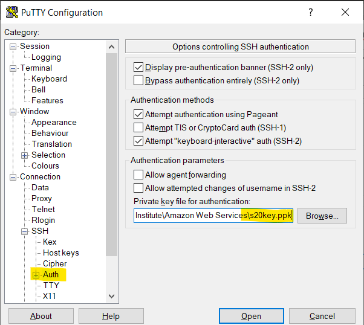

Select the .ppk file in Auth and open. We can save this session in
“session” configuration.

Now, we are on our instance via PuTTY.

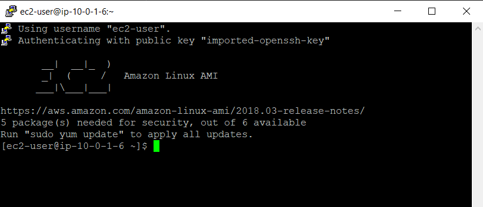

**Install http and php on this instance:**

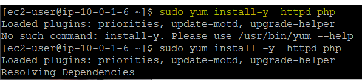

Start the service:

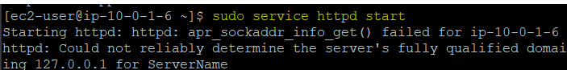

However, we cannot connect to this as our security group doesn’t have
http enabled. It only has tcp and icmp.

**Update inbound rules to add http:**

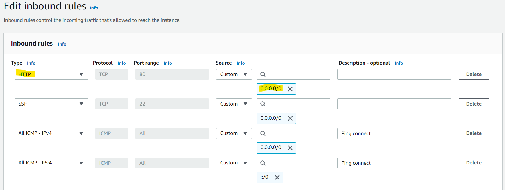

Now, when we try to connect using the Public IP of our instance, we can
see the default apache page loaded.

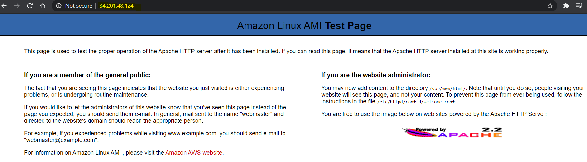

We can now add content to the directory /var/www/html/ to customize our
http page. But we will do this using user script so that the process is
done automatically every time an instance is launched. We will try this
on multiple instances at once.

\#!/bin/bash

**Update the linux OS:**

*sudo yum update -y*

**Install http:**

*sudo yum install -y httpd php*

**Start http:**

*sudo service httpd start*

**Create a php file to display IP address of current instance:**

*sudo echo "&lt;?php \\$ip = \\$\_SERVER\['REMOTE\_ADDR'\]; echo \\$ip;
?&gt;" &gt; phpinfo.php*

**Move this file to default apache location:**

*sudo mv phpinfo.php /var/www/html/*

**Create 3 instances:**

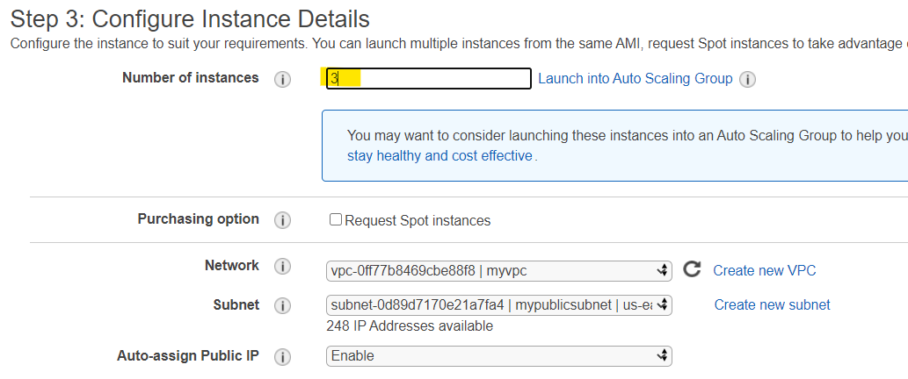

Pasting the user script in *advanced details*.

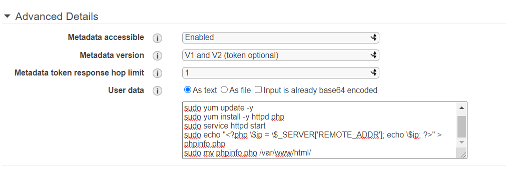

We use the security group that has http enabled.

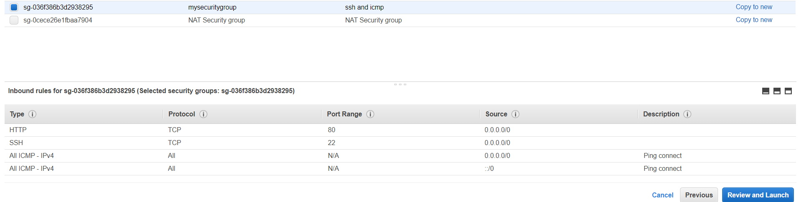

Now, we have 3 instances with same user script - the process of creating
a php file and moving it to source directory is automatically done at
launch.

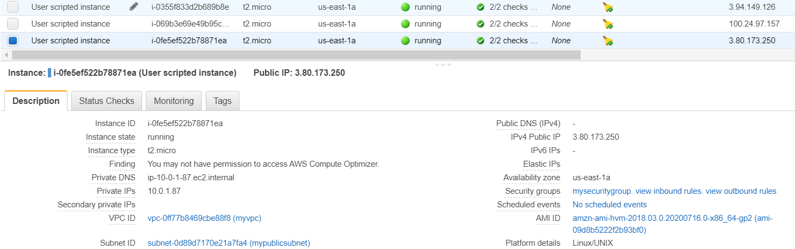

We use the IP address of any one instance and check if the user script
is working:

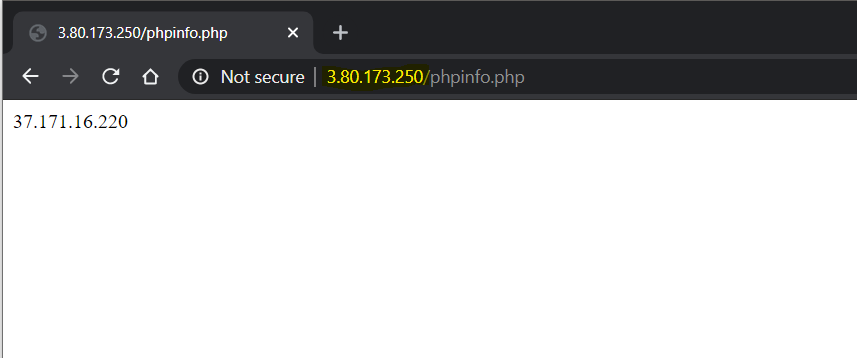

The instances are running, and script has been automatically implemented
at launch for all our instances.
