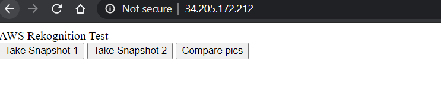
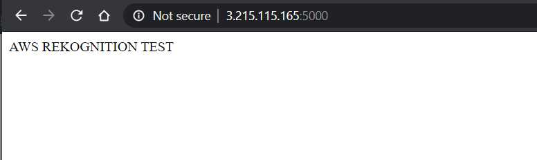
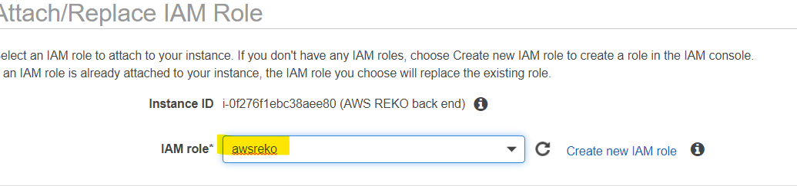

> **AWS REKOGNITION**

We use two instances (ubuntu) with:

1.  Apache – for front end

2.  Conda – for back end

**Create instances:**

Choose the ubuntu server:

We are going to use the same AMI for both instances

Create a new security group, we are going to edit the rules for
individual servers later:

Confirm the keypair and launch instances.

Now we have the instances up and running, rename the instances:

**Connecting via PuTTY:**

Use the public IP of ‘front end’ instance and select the .pem file in
SSH – Auth.

Save this login information and open.

**Install APACHE on this instance:**

On the front-end instance, update the package manager and install
Apache.

To check if it’s working, paste the public IP of this instance in a
browser and Apache’s default page should load up.

But, for our instance we didn’t configure the security group yet. We
need to enable “http” in the inbound rules of our SG.

Save the rules and It works!

**Move the front-end files to default location:**

Clone the code repository to out instance:

Navigate to the index.html in repo to move it to the default Apache
location mention mentioned on their page.

Now, when we reload our browser, we have the front-end page loaded up,
but the buttons don’t have any functionality.

Moving the other file from repo to default Apache location:

Now, we have the files from repo into the default apache location:

Normally, when we reload the browser page, the front end should work.
But in our case we need to do some checking inside the code.

We see in the script, it uses ‘static’ not “Static”:

To fix this, we can move rename the folder name on our instance:

Now, when we reload the page, we have the functionalities working:

This is a webcam access level error; we are going to fix later.

Front end is up and running on our EC2 Instance.

**Install conda on the other Instance:**

**Connect to other instance using PuTTY:**

Select the .pem file inside Auth and open the connection and update the
package manager.

Clone the repo on ‘back end instance’:

We moved the files from Frontend\_machine to the other instance, now we
are working on backend\_machine. We can see it is a .py file.

On this machine we need:

-   Conda

-   Virtual environment with Python 3.6

-   Packages – “Flask”, “flask\_cors” and “boto3”.

**Installing conda on backend instance:**

wget – to download from internet.

The installation file is now downloaded.

**Install Anaconda using bash:**

**Activating conda in current terminal:**

source \~/.bashrc

Conda is installed on ‘backend instance’

Create an environment with python 3.6.

Now, we are in virtual environment ‘flask\_env’

Install required packages:

-   conda install Flask

-   conda install -c anaconda flask-cors

-   conda install boto3

> pip freeze displays all the installed packages with their versions:

Now, we can run that .py file and it seems to run on port 5000.

This port is used to make a connection with front end. We need to enable
port 5000 on backend instance.

To test if the port is working, we can write a function in .py file to
display text.

Now we have backend and frontend up and running, we need to make a
connection between them so that they communicate with each other and the
Rekognition works.

**Creating IAM :  
**Looking at the code, we see that the the code requires IAM roles to
S3(to store pictures) and Rekognition API.

On the AWS console, go to IAM roles and enable access:

Review the roles and create:

**Attaching these roles to backend instance:**

Select the role that we created and apply:

Now, when we look at the .py code, we see that we also need a S3 bucket.

**Creating bucket to store captured images:**

Make sure the bucket name and location match with the one’s in the code.

Now, we have all the functions from .py working and AWS Rekognition
running.
