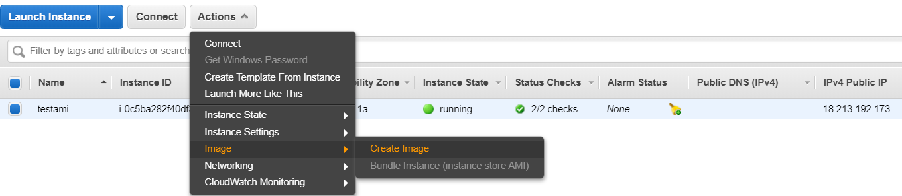

> **AMAZON MACHINE IMAGE**

Amazon machine images are tailored according to work case and there are
suite of images available to choose from starting from server use case
to deep learning.

**Launching an AMI:**

> Inside EC2, first choose the image for respective work case, we are
> going to work on Linux 8.
>
> 

Choose the instance type based on requirements:

> Configure network details for this instance, choose the private cloud
> and subnet settings that were created earlier.
>
> The option to enable ‘auto-assign public IP’ requests and IP address
> from available addresses with Amazon.
>
> Create
> a storage volume to be associated with this instance, this again
> depends on the use case of AMI.
>
> 
>
> Configure the security group settings to manage the access to this
> instance. In this case we need SSH to be able to access the machine.
>
> 
>
> For a secure connection, AWS provides a private key (stored on user’s
> drive) and a public key (stored with AWS). These keys allow
> confidential access to instances. We already created a key previously,
> so we are going to use the same one.
>
> 
>
> Launch instances and click on view instances.

Connect to the instance using any of the three methods available:

> In cmd, go to the directory where private key is located and launch
> ssh using the command.

Now, we are connected to the Linux 8 instance.

> An image of current instance can be created so that the user doesn’t
> have to configure default settings again.

This can be resumed from the resources under “Snapshots”

