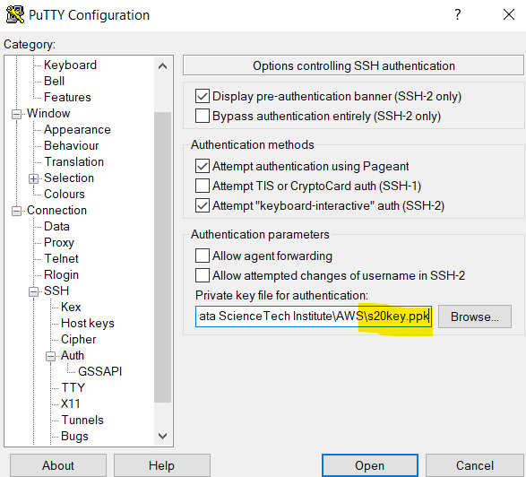

**Installing Jupyter on a remote machine.**

Launch an instance with the public subnet and enable “Auto-assign Public
IP”

Create a new security group to have complete control over the instance:

Confirm the key and launch instance from PuTTY.

Inside PuTTY: Go to Auth and select the path that directs to the key
used to launch instance.

Login using the public IP of our instance:

Now, we are connected to our instance:

**Installing Anaconda on our instance:**

Update the package manager:

sudo apt-get update

Install curl to be able to download from internet:

sudo apt-get install curl

Switch to the /tmp directory and use curl to download the installer
using your command terminal:

cd /tmp

curl –O
https://repo.anaconda.com/archive/Anaconda3-2020.07-Linux-x86\_64.sh

Anaconda is being installed:

Verify the download checksum:

sha256sum Anaconda3–2020.07–Linux–x86\_64.sh

Install Anaconda using bash:

bash Anaconda3-2020.07-Linux-x86\_64.sh.sh

Accept terms and conditions saying ‘yes’

Press Enter to install in same location or define a location.

Before accessing conda, we need to activate the installation using:

source \~/.bashrc

Test the installation:

conda info

We can update conda and anaconda using:

conda update conda

conda update anaconda

Now we can create Python environments:

conda create ––name myenv python=3

To activate this environment:

conda activate myenv

Now we’re in our environment:

To deactivate the environment:

conda deactivate myenv

To access jupyter notebook, back in the base environment:

To access this notebook in the browser, we use any of the following
links.

But this only works on local machine and since jupyter is not on local
machine, we need to change this:

Use “ jupyter notebook --ip=0.0.0.0” to make the notebook listen on
private IP.

Jupyter is now binding using private IP of our instance on gate 8888.

But, when we look at the security group of our instance, we only have
tcp enabled and we need port 8888 for notebook to connect.

**Update the security group to enable 8888 port:**

Save and copy the url from cmd. Note that it is bound with private IP
and we need to replace this with public IP of our instance.

After inserting Public IP:

When we run this on a browser, we have the notebook up and running:

If we want to run this even after the command prompt is closed, we can
use “nohup”

This command saves the token(that is need to be put in the url for
notebook) into a new file.

Now we have an additional file apart from anaconda3. Inside nohup.out we
have token saved.

The command prompt is closed, and we still have the notebook running:

We
need to get into our environment ‘myenv’ and install ‘ipykernel’

Now, linking the environments.

We
have our second environment ready on the browser.

