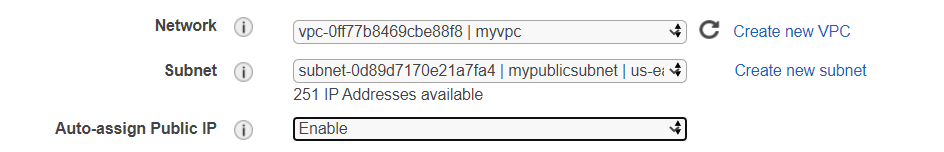
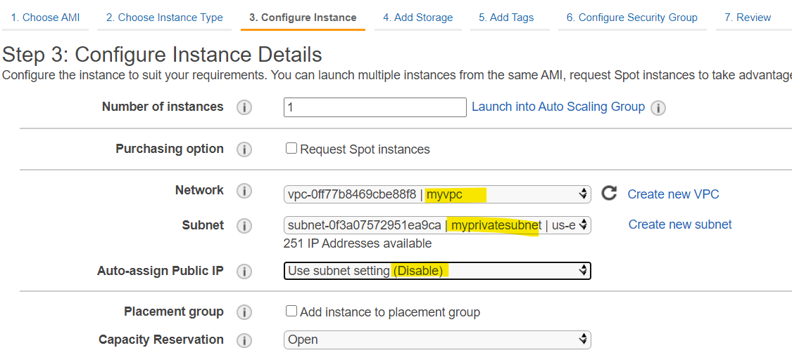

> **JUMP BOX**

Jump box enables a private instance to connect to the internet, for this
we need:

Public instance

NAT gateway (instance with NAT software)

Private instance.

**Create a public instance:**

Since this is a public instance, we select the public subnet(that has
route table to internet gateway) created earlier and enable auto-assign
for public IP.

Configure a new security group and add ICMP inbound rule that allows us
to ping to our instance.

After “review and launch” confirm the instance using private key that we
downloaded earlier

The instance is now up and running, all the details of this instance can
be found in the bottom window.

Pinging to this instance from local machine:

**Create a private instance :**

Launch a new instance with ubuntu and configure this instance using the
private subnet created earlier(doesn’t have access to internet gateway).

Since it does not have access to igw, there is no public IP, we don’t
need one.

Create a new security group to add a layer of security.

The source here corresponds to the security group of our previous
instance – “pinginstance”, so that only this instance can access the
private instance.

Confirm the key and launch instance.

Now we have two instances with the latest one being private instance, it
does not have a public IP address and only allows access to the
instances of security group included in the source of private instance’s
security group.

Now, login to the public instance using ssh key.

IP-10-0-1-71 is the private IP of our public instance.

IP- 10.0.2.69 is the private IP of our private instance.

We ping from public instance and private instance answers and it answers
to only IP-10-0-1-71 as this is included in private instance’s security
group.

**Connect to private instance from public instance:**

To do this, we need the key to be available on this instance that is
currently on the hard disk of administrator.

We copy this file to ‘pinginstance’ using scp:

realkey.pem is key for pinginstance

s20key.pem is key for myprivateinstance

On our public instance we have the key required to access private
instance :

But before using the connect command, we need to make .pem file read
only using chmod.

Now we are connected to private instance via public instance.

Here, private instance is logged out and we are back to public instance.

Now, for the private instance to connect to internet we need to
configure a bridge.

**Create a NAT Instance**

NAT requires specific software’s to be installed so we use an AMI
instead of creating a new instance. We pick one from the pool of
community AMI’s that has the software installed.

We put this instance in a public subnet.

Configure the security group to only allow connections from private
instance by including the security group of private instance in the
source of NAT instance.

Confirm the key and launch instance.

Now, we have 3 instances private – in privatesubnet, public and NAT – in
public subnet which is a bridge for private instance to connect to the
internet.

We need to configure a route table in private subnet for the traffic to
be re-directed to NAT instance.

Private instance &gt; NAT instance &gt; internet

Since this instance is a bridge, we do not need source/destination
checks.

Now, private instance(10.0.2.69) has access to internet via NAT instance
from public instance(10.0.1.71).

Public instance &gt; private instance &gt; NAT &gt; internet

