**Relational Database Service**

Search for RDS in AWS Console and create database, we can also restore
from S3 if we have one saved.

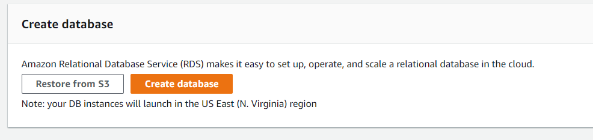

We create MySQL database:

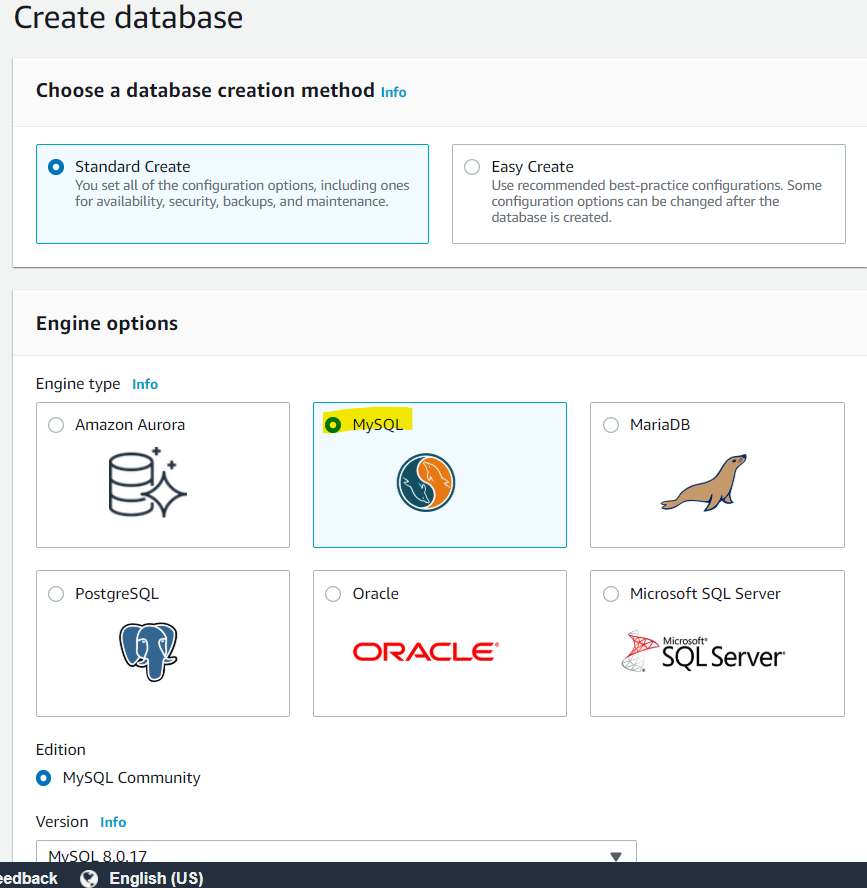

Give a name to this instance and provide a password:

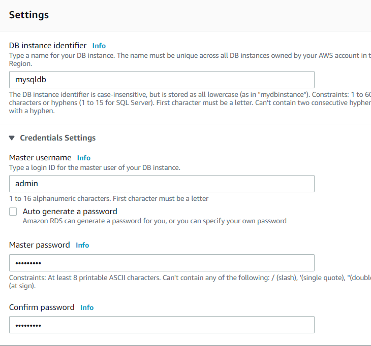

Choose a suitable CPU and RAM configuration depending on the database
use
case: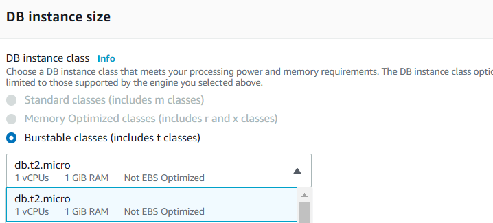

Configure the storage – depends on database, we can also enable storage
autoscaling depending on use case.

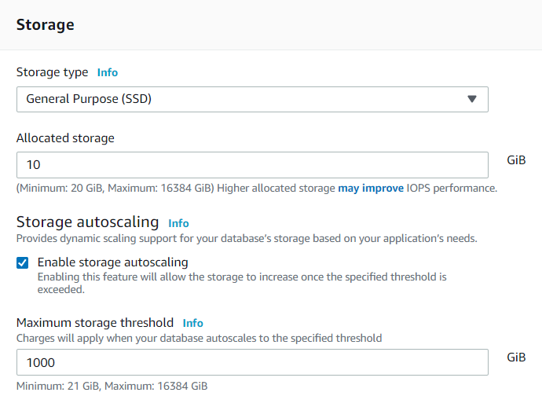

Creates a backup instance to ensure availability and durability.

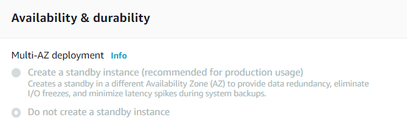

Configure the connectivity for this instance:

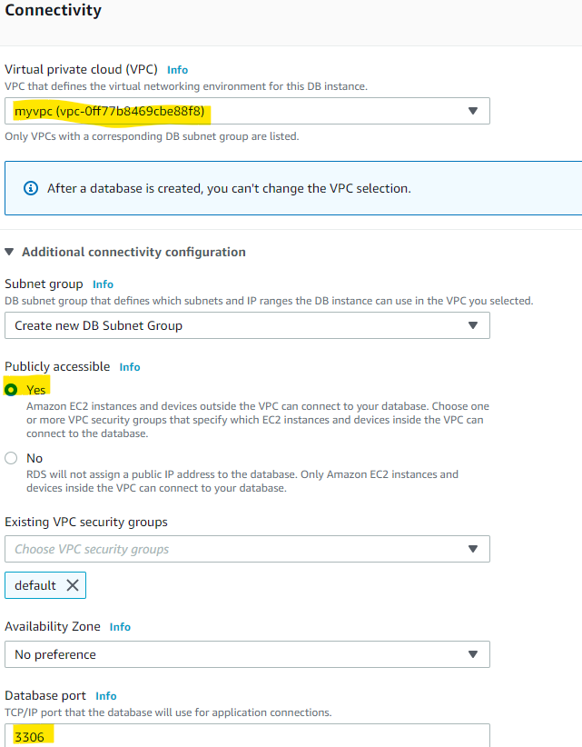

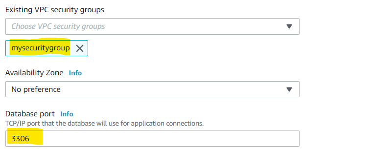

Port 3306 is default MySQL port.

Give database a name and we can also enable automatic backups from here:

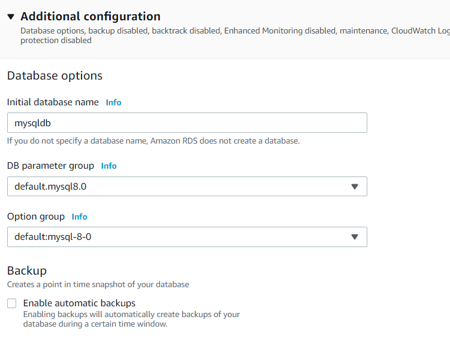

We cannot create the database yet, it is a requirement of AWS RDS to
have subnets at at least 2 availability zones.

**Create another subnet at a different AZ:**

We have one in us-east-1a, we are going to create another one in 1b.

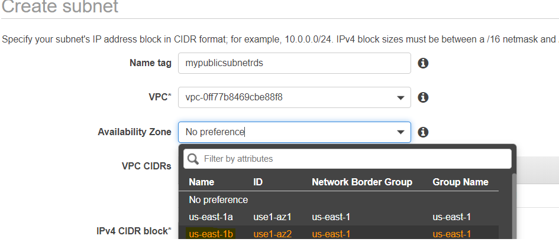

Now, we have two subnets at different AZ’s :

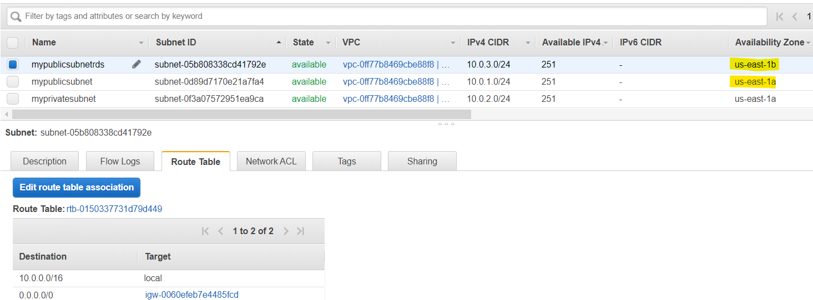

Refresh, the connectivity tab on ‘Create database’ page.

We have another error to fix in the VPC:

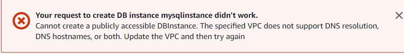

Go to VPC and check if both are enabled:

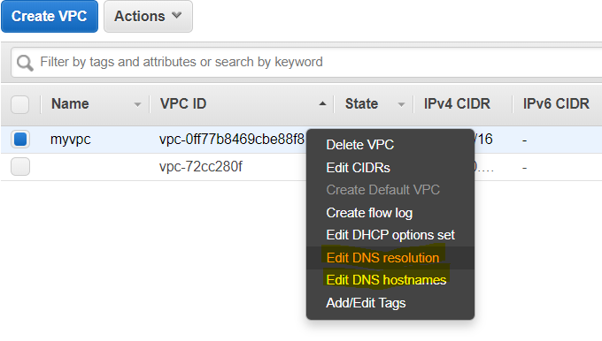

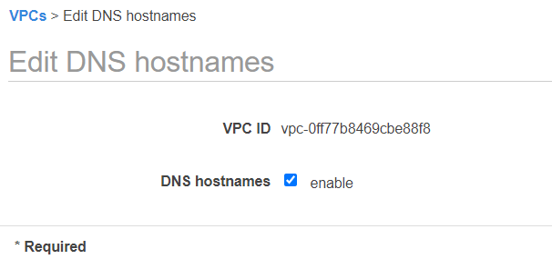

Refresh, the connectivity tab on ‘Create database’ page and create
database.

Now we have the database instance up and running

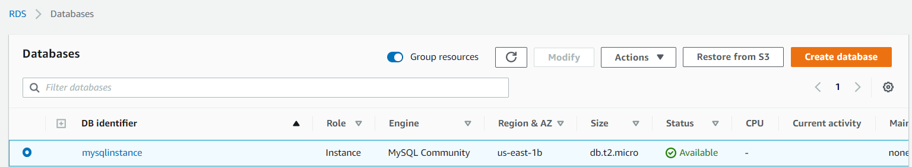

We can connect to this database using MySQL Workbench

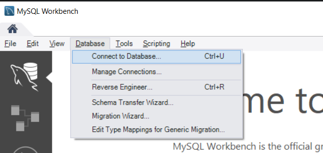

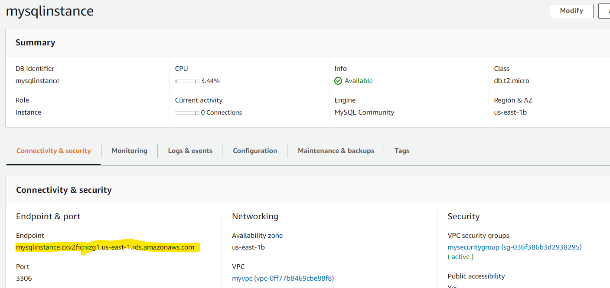

We can use the endpoint instead of hostname to connect to our instance.
Use the username and password created earlier.

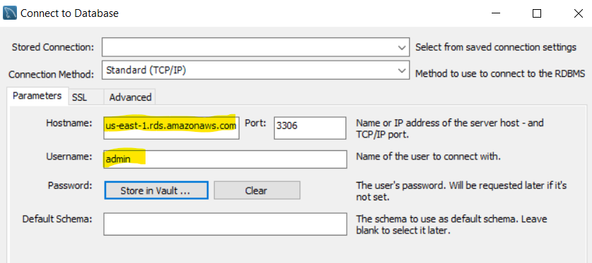

Click ok and wait for it to launch.

If this error pops up, it is ‘connection timed out’, we can fix this in
the security groups.

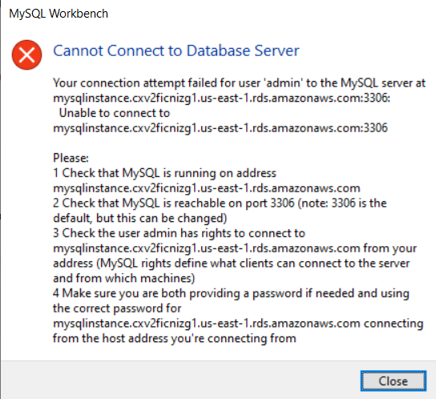

Looking at our security group, we can see there’s no port 3306 enabled,
this is default port for MySQL. We are going to enable it.

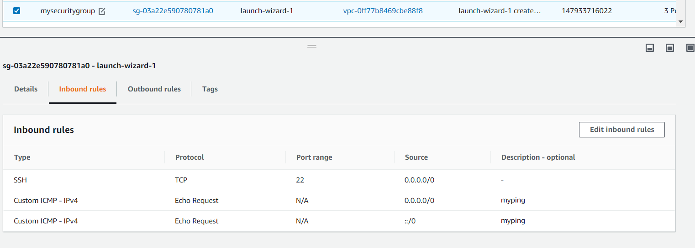

Click on edit inbound rules, Add rule.

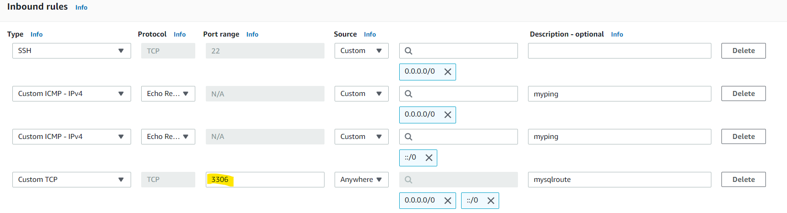

Save rules and try to connect again in Work bench.

If the error still pops up, we might need to look at the subnets.

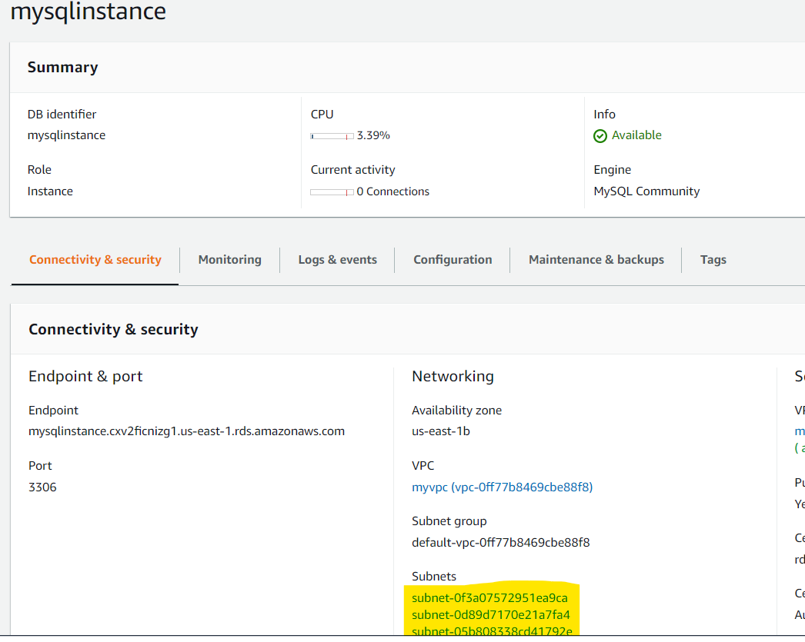

Check if all subnets are having igw if not add rules to access internet
gateway.

The connection to database is active on AWS via workbench:

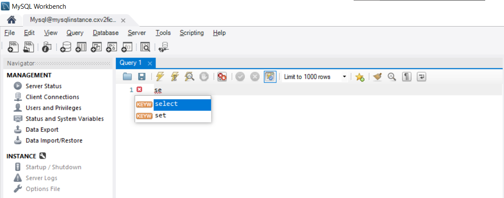
